# DashiAI PPT Skill · 大师 PPT / 网页 PPT / 可编辑 PPTX


[](./LICENSE)

> 🌏 **English version: [README.en.md](./README.en.md)**

一个真正适合职场人的 PPT Skill。把文档丢给你的 AI Agent，几分钟后拿到一份**可离线打开、可横向翻页、每一页都自带编辑控制台**的网页 PPT——不满意的地方直接在浏览器里改，改完还能**一键导出成真实的、可编辑的 PPTX**。

- **12 套视觉主题**：轻拟态、炫光紫绿、深浅代码、玻璃糖果、色谱图表、深色图谱、冷白调研、黑金实验、深蓝杂志、金色指数、高能增长、声波霓虹
- **1020 个版式页面**：从几十种图表、SWOT / 波特五力 / 商业模式画布等分析模型，到架构图、时间线、图文画廊——做汇报真正会用到的页面都有现成版式
- **8576 个可调控件**：2372 个滑杆、4276 个开关、1825 个下拉，以及百余个图片 / 图标选择器——拖一下滑杆就能增减页面模块
- **生成 ≠ 结束**：改文字、换布局、换图表、换配色、换风格，全部在浏览器里完成，编辑自动写回文件

> 我们花了两个多月，和团队里最专业的设计师一起打磨这套 Skill。丰富的视觉效果只是它的表象——真正想解决的问题是：**让生成之后如何编辑这件事，比生成本身更重要。**

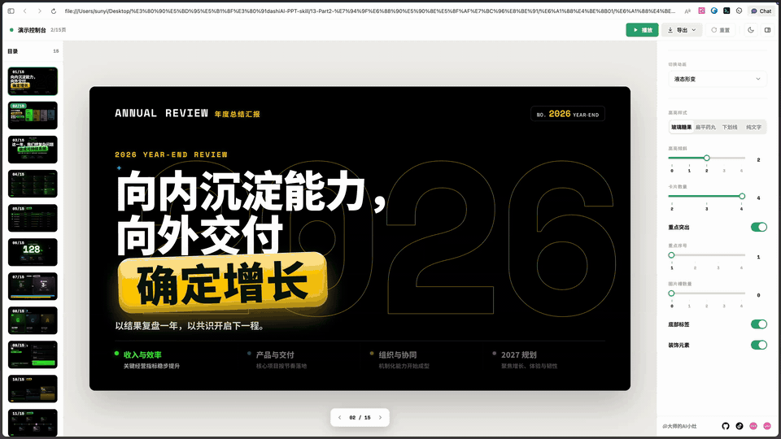

## 12 套内置视觉主题

生成时 Skill 会展示预览让你选，你也可以随时让 Agent 整套换掉。下面每套主题的预览，都是从它自己的版式库里挑出的 4 个正文版式（图表、分析模型、卡片、目录等），**全部由这个 Skill 真实渲染，非示意图**：

|  |  |
|---|---|
| 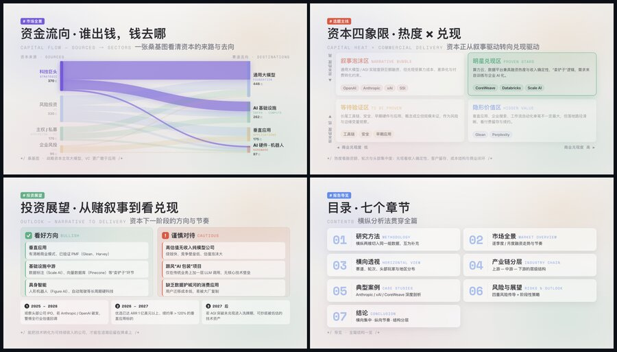<br>**theme01 轻拟态风**<br>适配场景：产品介绍、企业汇报、方案说明、轻量级发布<br>适配人群：创业团队、产品经理、销售顾问 | 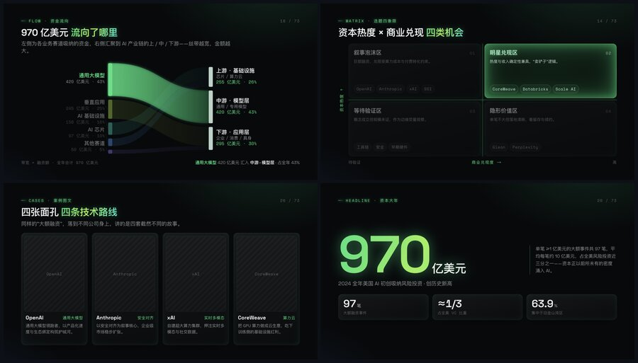<br>**theme02 炫光紫绿风**<br>适配场景：科技发布会、AI / 自动驾驶 / 机器人主题、增长故事<br>适配人群：科技公司创始人、技术负责人 |
| 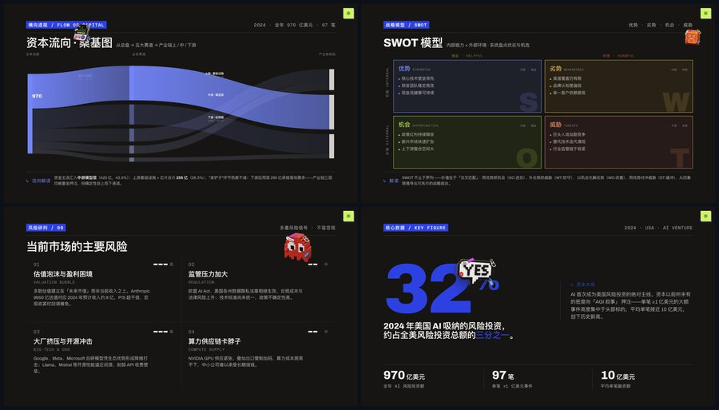<br>**theme03 深浅代码风**<br>适配场景：技术方案、开发者大会、系统架构、AI 工程实践<br>适配人群：工程师、架构师、开发者社区 | 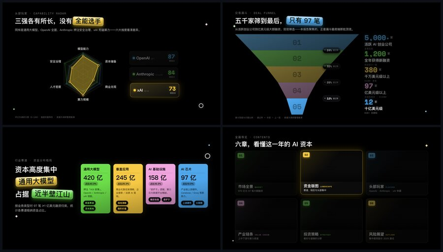<br>**theme04 玻璃糖果风**<br>适配场景：年轻化品牌、消费产品、创意提案、社媒感内容<br>适配人群：品牌团队、设计师、内容创作者 |
| 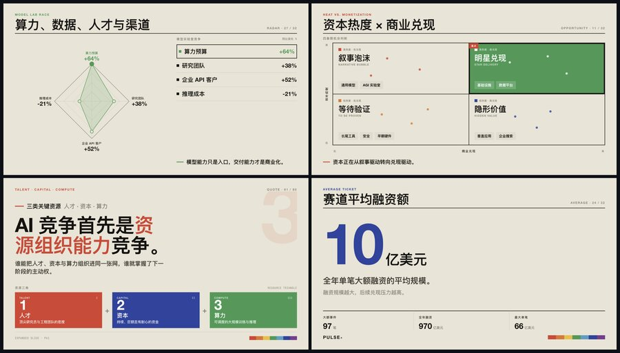<br>**theme05 色谱图表风**<br>适配场景：数据报告、市场分析、KPI 复盘、行业研究<br>适配人群：数据分析师、咨询顾问、研究员 | 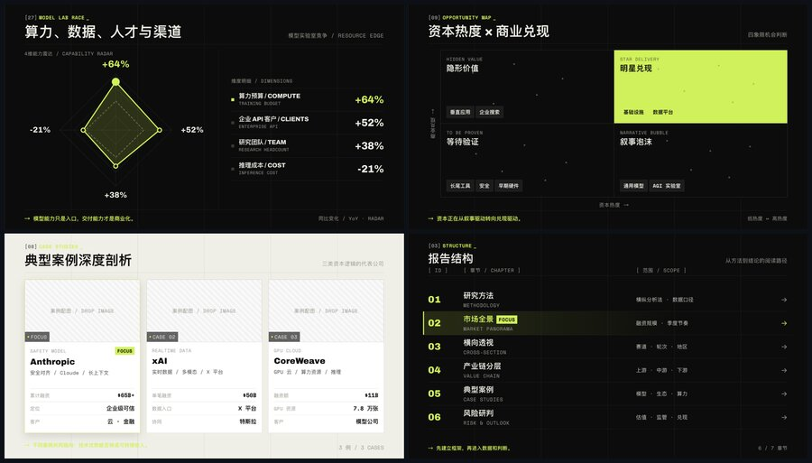<br>**theme06 深色图谱风**<br>适配场景：高密度数据展示、战略分析、科技 / 金融 / 产业报告<br>适配人群：战略团队、投资人、高管汇报者 |
| 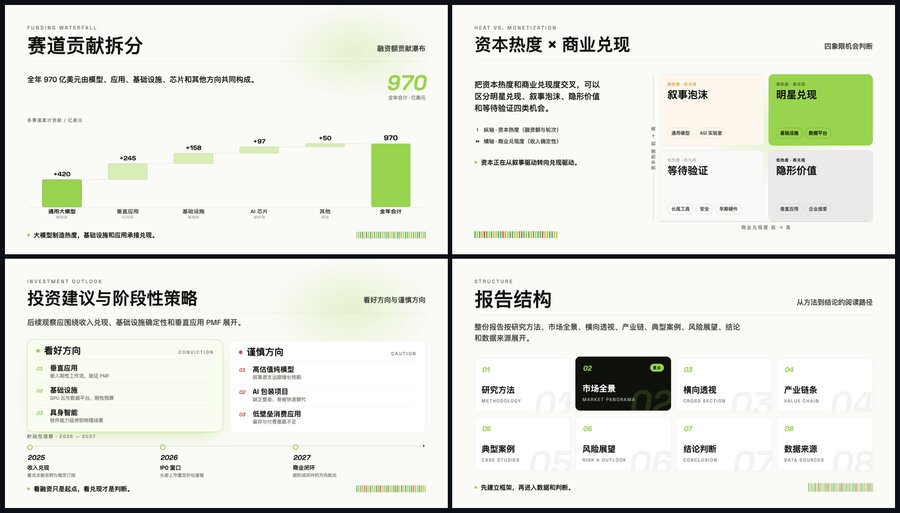<br>**theme07 冷白调研风**<br>适配场景：调研报告、白皮书、竞品分析、学术 / 政策型表达<br>适配人群：研究机构、咨询团队、智库 | 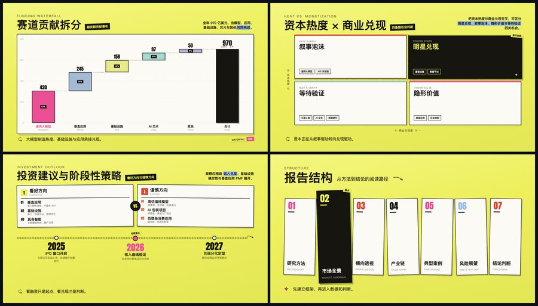<br>**theme08 黑金实验风**<br>适配场景：高端发布、品牌提案、实验性概念、奢华科技叙事<br>适配人群：高端品牌、创意总监 |
| 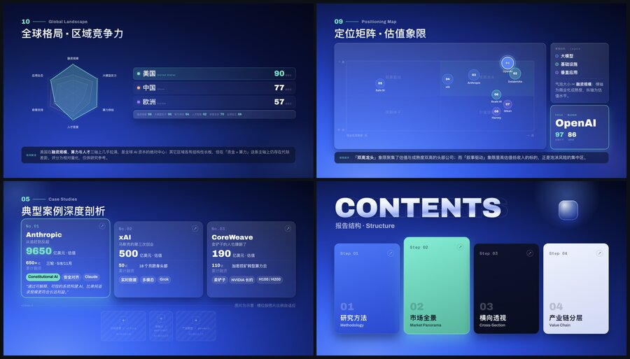<br>**theme09 深蓝杂志风**<br>适配场景：品牌故事、人物访谈、企业形象册、深度专题<br>适配人群：公关团队、媒体编辑、创始人 | 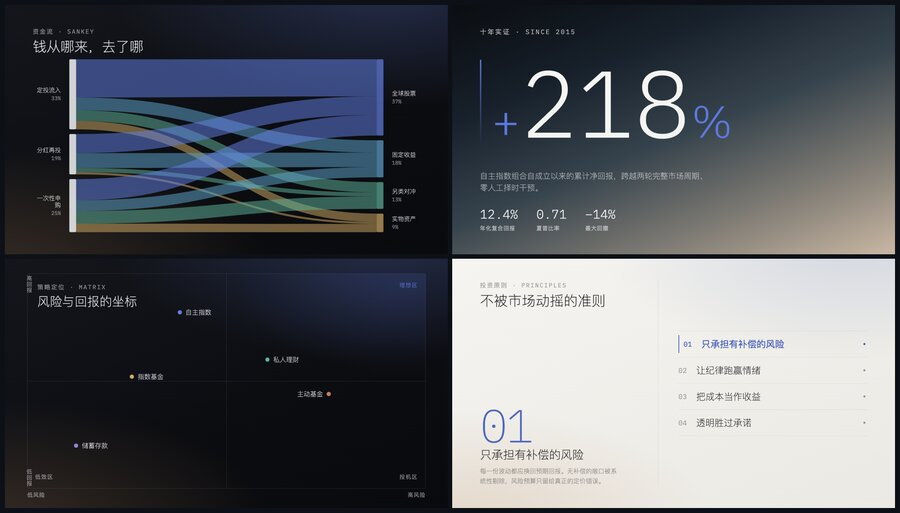<br>**theme10 金色指数风**<br>适配场景：金融数据、投资报告、商业指数、年度榜单<br>适配人群：投资机构、金融分析师、商业媒体 |
| 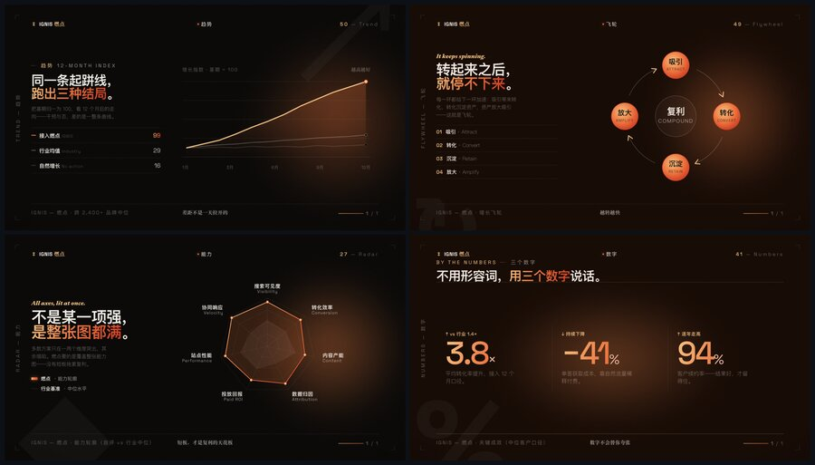<br>**theme11 高能增长风**<br>适配场景：增长复盘、商业计划、融资路演、市场扩张方案<br>适配人群：创业者、增长团队、VC/PE 路演 | 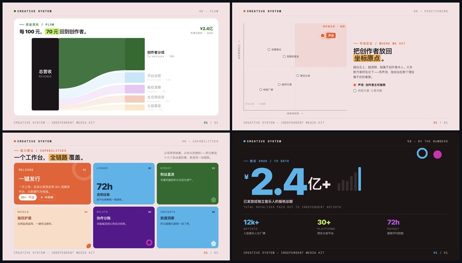<br>**theme12 声波霓虹风**<br>适配场景：音乐娱乐、潮流活动、直播内容、年轻化发布<br>适配人群：娱乐品牌、活动策划、潮流消费品牌 |

## 30 秒开始

```bash
npx skills add https://github.com/chuspeeism/dashiAI-ppt-skill --skill dashiai-ppt
```

也可以直接把这段话发给有 shell 权限的 AI Agent：

```text
帮我安装 dashiai-ppt 这个 skill。请把 https://github.com/chuspeeism/dashiAI-ppt-skill 克隆到 ~/.claude/skills/dashiai-ppt（Codex 用户放到 ~/.codex/skills/dashiai-ppt），安装完成后检查 SKILL.md、project/、references/、scripts/ 是否存在。
```

已经安装过的话，用这段话更新：

```text
帮我更新 dashiai-ppt。请进入 ~/.claude/skills/dashiai-ppt 执行 git pull，然后告诉我当前最新 commit。
```

安装后直接对 Agent 说：

```text
帮我制作一份年终总结汇报 PPT。
```

也可以试这些请求：

```text
根据我这份文档，生成一份科技感的 PPT，10 页左右。
把这套 PPT 的风格换成学术感拉满的专业风格。
用 dashiai-ppt 直接生成 PPT 格式的文件（跳过网页，直接交付可编辑 PPTX）。
```

## 效果

- 🎨 **12 套视觉主题**：从轻拟态到声波霓虹，覆盖产品介绍、技术方案、数据报告、品牌故事、融资路演等场景
- 🧩 **1020 个版式页面**：每套主题独立的页面结构和视觉语言，20 种页面角色（封面、目录、指标、趋势、对比、流程、风险、结尾……）
- 📊 **图表与分析模型开箱即用**：雷达图、瀑布图、矩形树图、漏斗、热力图、桑基图、甘特图，以及 SWOT、波特五力、PEST、商业模式画布、双钻模型等分析模型版式
- 🎛 **每一页自带控制台**：滑杆、开关、下拉——换布局、调模块数量、换配色、换页面重点，拖一下就生效
- ✏️ **全局文字可编辑**：点击任意文字就地修改，带装饰效果的文字会随字数自动适配
- 🖼 **图片 / 视频即点即换**：点击或拖拽替换媒体槽，图片自动压缩；纯文字资料也会自动预留图片占位符
- 🔄 **一键换风格**：同一份内容在 12 套主题间实时换肤，还有 9 种翻页切换动画可选
- 📄 **三种导出**：HTML 单文件离线包 / PDF / 可编辑 PPTX，也可以从一开始就直接要 PPTX
- 💾 **全部本地**：生成、编辑、导出都在本机完成，编辑自动写回文件，成品不依赖原始素材路径

## 适合 / 不适合

**✅ 合适**：行业研究 / 融资复盘 / 竞品分析 / 趋势报告 / 项目汇报 / 方案展示 / 路演材料 / 内部培训——需要快速形成结构完整、视觉统一、还能继续改的演示文稿

**❌ 不合适**：需要多人同时在线协作编辑（本地文件）/ 需要逐像素手工定制视觉的场景（模板视觉默认锁定，用自由度换美学下限）/ 没有文件系统和 shell 的纯网页 Chatbot

## 常见使用场景

| 任务 | 推荐方式 |
|------|---------|
| 长文档变汇报 PPT | 把文档丢给 Agent，说明受众和页数，Skill 会先问你要哪种风格 |
| 年终总结 / 业务复盘 | 直接说"帮我做一份年终总结汇报 PPT"，数据页、指标页自动排布 |
| 数据 / 研究报告 | 选色谱图表风、深色图谱风或冷白调研风，图表版式占比高 |
| 融资路演 / 增长故事 | 选高能增长风或金色指数风，自带资金流、指数、里程碑版式 |
| 直接交付 PPTX | 明确说"生成 PPT 格式的文件 / 导出 PPTX"，跳过网页中间态 |
| 给领导 / 同事演示 | 预览服务默认支持局域网访问，手机平板直接打开；放映模式一键进入 |

## 为什么是 HTML PPT——但不止是 HTML

- **更适合 Agent 生成和修改**：HTML / JSON 是文本，Agent 能直接读、改、校验；每一页由"版式 + 文案字段"构成，改文案不会破坏视觉。
- **表现力更高**：入场动画、翻页动画、交互控件、明暗模式，这些是静态格式给不了的体验。
- **产物本身就是编辑器**：生成的不是一张张贴图，而是一个网页版 PPT 编辑器——翻页、改字、换图、调版式，打开就能用。
- **交付更轻**：一键打包成单文件 HTML，离线可开；本地预览服务默认支持局域网访问，同一 WiFi 下手机平板直接看。
- **不把你锁死在网页里**：如果你厌倦了 AI 时代"用网页伪装的假 PPT"，一键导出成真实的 PPTX——逐节点还原、文字保持可编辑，导出引擎 [html-deck-to-pptx](project/packages/html-deck-to-pptx) 以 MIT 协议开源。

HTML 版与导出 PPTX 版的逐页对比：

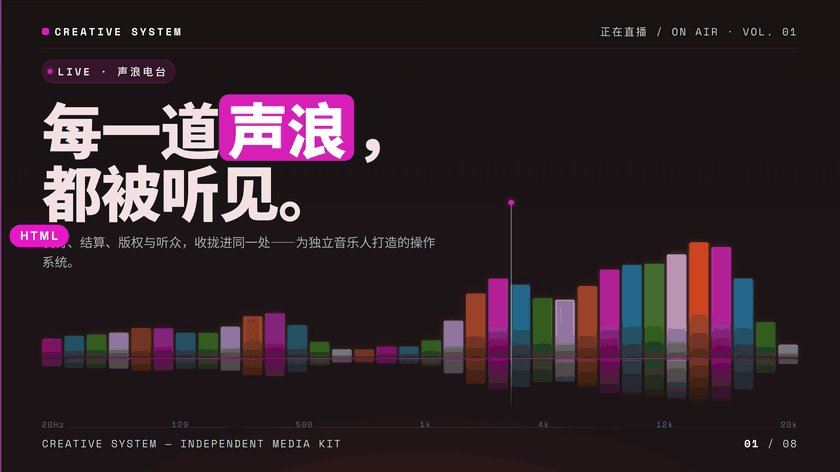

## 平台支持

| 平台 | 状态 | 说明 |
|------|------|------|
| Claude Code | 支持 | 原生 Skill 工作流，生成、迭代、导出全流程 |
| Codex | 支持 | 内置 `agents/openai.yaml` 配置，另可调用生图能力补充配图 |
| 豆包 | 支持 | 刚支持 Skill 的豆包也能跑出很好的效果 |
| Cursor / 其他本地 Agent | 可用 | 需要能读写文件并执行 shell 命令 |
| 普通网页 Chatbot | 不推荐 | 生成器需要本地 Node.js 环境 |

## 安装

### 方式一：一行命令安装（推荐）

```bash
npx skills add https://github.com/chuspeeism/dashiAI-ppt-skill --skill dashiai-ppt
```

### 方式二：把下面这段话直接发给 AI

> 帮我安装 `dashiai-ppt` 这个 skill。请按下面步骤做：
>
> 1. 确保 `~/.claude/skills/` 目录存在（不存在就创建；Codex 用户为 `~/.codex/skills/`）
> 2. 执行 `git clone https://github.com/chuspeeism/dashiAI-ppt-skill.git ~/.claude/skills/dashiai-ppt`
> 3. 验证：`ls ~/.claude/skills/dashiai-ppt/` 应该看到 `SKILL.md`、`project/`、`references/`、`scripts/`
> 4. 告诉我安装好了，之后我说"帮我做一份 PPT"之类的话就会触发这个 skill

把这段话复制粘贴给 Claude Code / Codex / 任何有 shell 权限的 AI Agent，它会自动完成安装。

### 方式三：手动命令行

```bash
# Claude Code
git clone https://github.com/chuspeeism/dashiAI-ppt-skill.git ~/.claude/skills/dashiai-ppt

# Codex
git clone https://github.com/chuspeeism/dashiAI-ppt-skill.git ~/.codex/skills/dashiai-ppt
```

环境要求：本机能运行 **Node.js 18+ 和 npm**（首次生成时依赖自动安装）；导出 PPTX / PDF 需要本机装有 Chrome / Chromium / Edge。

### 触发方式

装好后，Agent 会在对话里自动发现并调用这个 skill。触发关键词：

- "帮我做一份 PPT / 演示文稿 / 幻灯片 / 汇报材料"
- "帮我制作一份年终总结汇报 PPT"
- "根据这份文档生成一份科技感的 PPT"
- "把风格换成更活泼的"
- "用 dashiai-ppt 生成 PPT 格式的文件"

## 使用流程

把手头的文档丢进去，直接说要做 PPT（Agent 会自动发现这个 skill，也可以点名 `dashiai-ppt` 强制指定），等待几分钟就能生成一份完整的 PPT：

1. **描述需求** — 主题、受众、页数、想突出的结论（只说个主题、内容让 AI 自拟也行）
2. **选风格** — 没指定风格时，Skill 会展示 12 套风格预览图让你选，不会替你决定；同时确认是否需要图片 / 视频
3. **自动组稿** — Skill 把需求整理成结构化的 `goal.json`，从版式库选页、填文案、跑多道校验后渲染
4. **拿到链接** — 生成完给你一个本地网页链接，点开就是网页版 PPT 编辑器
5. **随手编辑** — 每一页都带控制台：改文字、换图片、调模块数量、换配色，改动自动保存回文件
6. **交付** — 不满意让 Agent 换风格重来；满意了导出 HTML 离线包 / PDF / 可编辑 PPTX

如果你提供的是纯文字资料，Skill 会根据实际情况在合适的页面里预留图片位置，后续点击占位符就能填图：

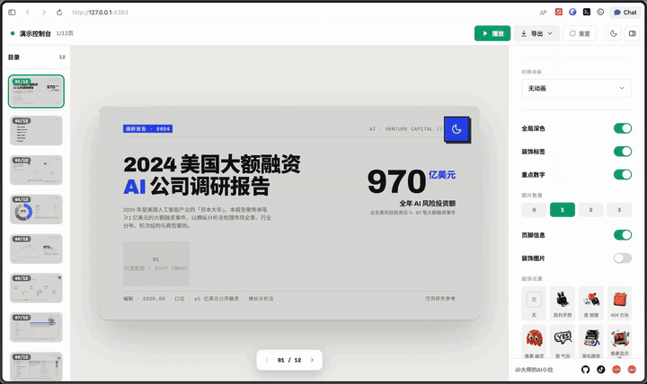

## 生成后编辑：每一页都自带控制台

这个 Skill 最重要的设计：**生成之后如何编辑，比生成本身更重要。** 每张页面都附带一个控制台，我们总计设计了 20 多个维度的编辑空间——内容、布局、模块数量、页面重点、预设配色、翻页动画，你常需要改的它都留了位置（配色和字体走预设方案，不开放自由填值，理由见下文）。

### 直接改：文字与图片

全局文字点击就能编辑，带装饰效果的文字会根据字数自动适配；图片、视频槽位点击或拖拽即可替换，上传的图片自动压缩。

| 点击任意文字就地编辑 | 加图片 |
|---|---|
| 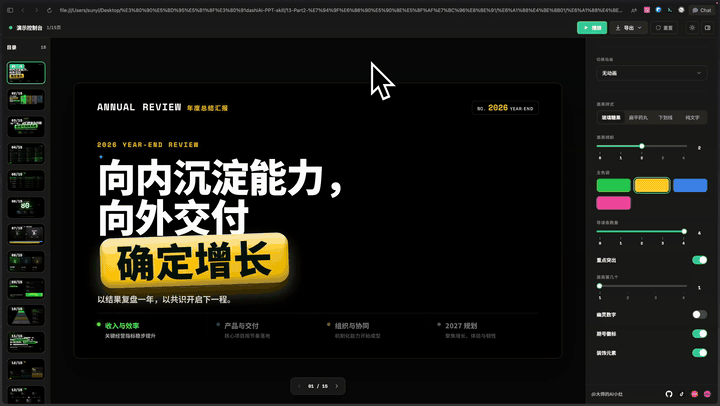 | 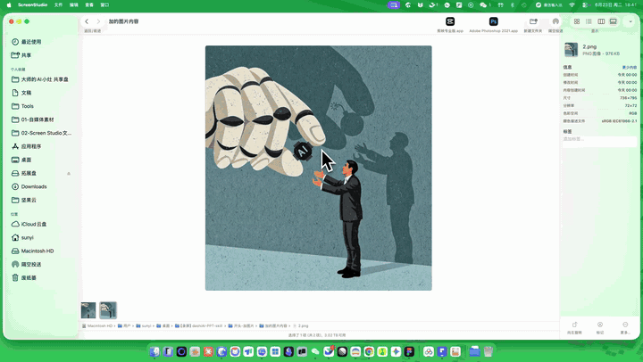 |

### 控制台改：布局、模块数量、图表、配色

目录页、表格页、多项式页（一页多个并列条目的版式）、图文页——拖动控制台右侧的滑杆，就能自定义页面中模块的数量；页面的逻辑重点也可以通过滑杆调换，帮你把握演讲节奏。

| 拖滑杆增减模块 | 换布局 |
|---|---|
| 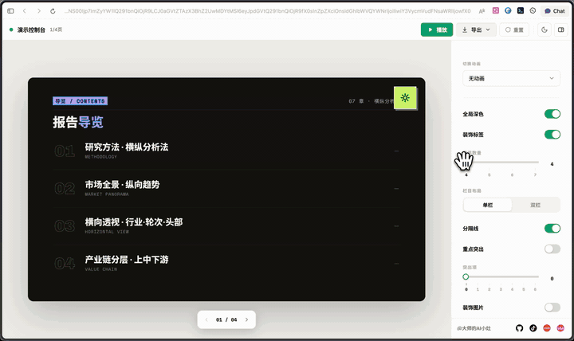 | 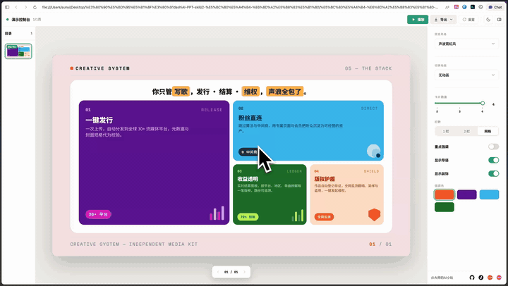 |

| 换图表 | 风格内配色切换 |
|---|---|
| 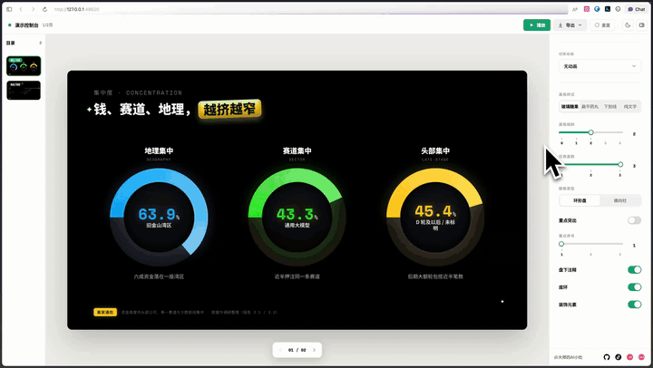 | 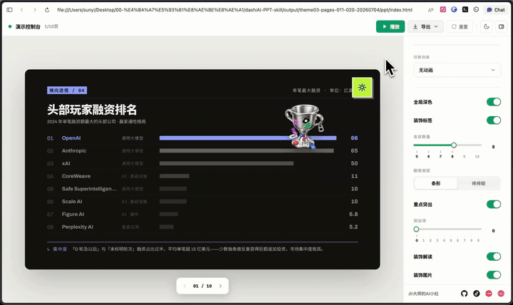 |

### 翻页动画

内置 9 种切换动画：液态形变、切入、横滑、行扫、缩放、竖条、混合、横切、画廊（不想要动画也可以一键关掉）。在控制台里选一个喜欢的效果，一键切换：


### 还有更多

- 左侧缩略图目录支持**拖拽重排页面**，页面可**跳过 / 删除 / 复制**
- 顶栏一键进入**放映模式**、切换**明暗主题**、**重置全部**改动
- 通过本地预览服务打开时，所有编辑**自动写回 `index.html` 本体**；直接双击打开 HTML 文件时，改动保存在浏览器里，分发前记得导出

## 版式库里都有什么

写这份 README 的时候，我们把 12 套主题都真实渲染了一遍，也把 1020 个版式的清单完整翻了一遍。做汇报真正会用到的页面，基本都能找到现成版式：

- **图表页**：折线、柱状、瀑布、雷达、矩形树图、漏斗、热力、桑基、哑铃、气泡、散点、玫瑰、帕累托、旭日、华夫、坡度……几十种图表形态都是现成页面，AI 会把数据和结论文案按你的内容一并改写
- **分析模型**：SWOT、波特五力、PEST、商业模式画布、波士顿矩阵、双钻模型、AARRR、RFM、飞轮、技术成熟度曲线、泳道图、甘特排期
- **架构与关系**：产业链分层、层级结构、径向关系、网络图、脑图、组织架构、生态圈
- **图文页**：画廊、胶片条、马赛克拼贴、宝丽来、双联/三联、情绪板、图片墙
- **叙事节奏页**：金句、宣言、章节幕、目录、时间线、里程碑、FAQ、团队介绍、结尾页

翻一遍图表版式（2 倍速）：

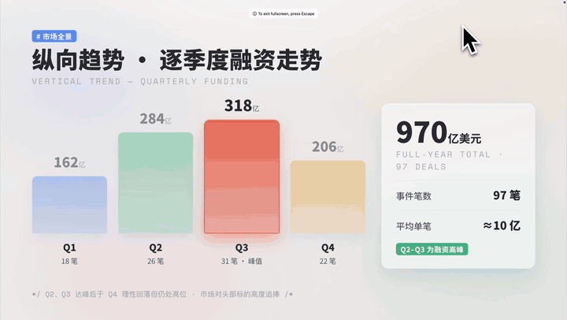

内置的分析模型与专业版式（SWOT、波特五力、PEST、商业模式画布、双钻模型、资本流向桑基图……）：

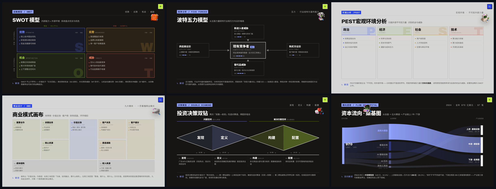

高频使用的目录页、表格页、数字海报页、图文页：

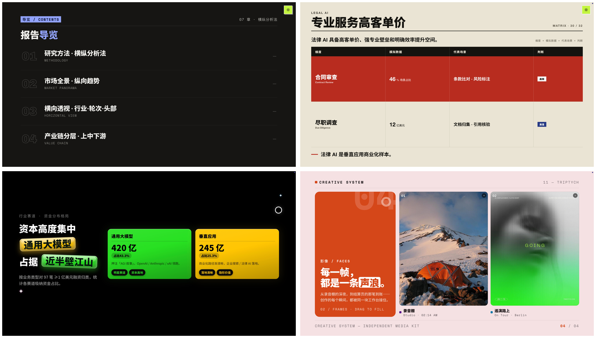

版式库的组织方式：

- **20 种页面角色**：封面、摘要、目录、章节分隔、背景、指标、趋势、对比、比例、关系、案例、图片、流程、风险、展望、氛围、行动、要点、团队、结尾
- **每页一个主要信息角色**：信息过多时压缩文字、拆页或换版式，而不是把一页塞爆
- **封面规则**：每套主题前 5 页为封面候选，一个 deck 只用 1 页封面，且全 deck 版式不重复

## 导出：HTML / PDF / 真正可编辑的 PPTX

浏览器右上角的导出菜单有三个选项：

- **HTML**：纯前端打包成单文件离线包，直接双击打开，发给谁都能看
- **PDF**：适合归档和打印
- **PPTX**：**可编辑导出**——逐节点还原版式，文字全部保持可编辑，交给领导 / 老师 / 同事继续改完全没问题


你甚至可以跨过 HTML 这个中间态，直接跟 Agent 说"用这个 skill 生成 PPT 格式的文件"，从提示词一步到 PPTX。

命令行导出（无需打开浏览器；装在 Codex 的话把 `~/.claude` 换成 `~/.codex`）：

```bash
npm --prefix ~/.claude/skills/dashiai-ppt/project run export:pptx -- <PPT输出目录>/ppt 输出.pptx
npm --prefix ~/.claude/skills/dashiai-ppt/project run export:pdf  -- <PPT输出目录>/ppt
```

## 目录结构

```
dashiAI-ppt-skill/
├── SKILL.md              ← Skill 主文件：工作流、原则、命令说明
├── README.md             ← 本文件
├── README.en.md          ← English version
├── LICENSE               ← AGPL-3.0 开源协议
├── agents/
│   └── openai.yaml       ← Codex / OpenAI Agent 界面配置
├── assets/               ← 风格预览图、图标、README 配图
├── project/              ← 内置生成器（React 渲染、12 套主题、导出引擎）
│   ├── layout-manifest.json  ← 1020 个版式的字段契约清单
│   ├── scripts/              ← 渲染 / 校验 / 预览 / 导出脚本
│   └── packages/html-deck-to-pptx  ← 可编辑 PPTX 导出引擎（MIT 开源）
├── references/
│   ├── options.md            ← 主题清单与生成选项
│   ├── layout-pool.md        ← 12 套主题的版式池
│   ├── layout-roles.md       ← 20 种页面角色说明
│   ├── goal-spec.schema.json ← goal.json 的 JSON Schema
│   └── examples/             ← 产品组合策略、融资年度回顾两个示例 spec
└── scripts/
    ├── render_goal_deck.sh       ← 一键渲染入口（校验→渲染→再校验→起预览）
    └── check_latest_version.mjs  ← 静默版本检查
```

## 核心设计原则

1. **编辑比生成更重要** — 产物是编辑器不是贴图，每一页都要经得起"再改一改"
2. **锁模板填文案** — 默认保留版式的原始视觉、结构、配色和图表类型，只替换文字内容，用模板锁定保住美学下限
3. **实用版式优先** — 图表、逻辑图、架构图、分析模型是汇报的常态，做成现成页面开箱即用
4. **每页一个信息角色** — 信息过多就压缩、拆页或换版式，不把一页塞爆
5. **校验兜底** — 渲染前后多道自动校验，模板默认文案（占位内容）绝不允许出现在交付里
6. **交付纯净** — 交付的成品默认不带主题切换器、页码标识和翻页引导，观众看到的就是一份干净的 PPT
7. **全部本地** — 生成、编辑、导出都在本机完成，成品不依赖原始素材路径，适合归档和交付

## FAQ

**真的能导出可编辑的 PPTX 吗？**
能。这是这个 Skill 和"网页伪装的假 PPT"最大的区别。导出引擎逐节点把 HTML 版式还原成 PPTX 原生元素，文字全部保持可编辑；实在无法映射的区域会转成图片，但文字仍从实时 DOM 抽回，保持可编辑。虽然 PPT 无法拥有 HTML 的全量能力，但我们尽最大可能保留了可编辑性。

**生成一套 PPT 大概消耗多少 token？**
一套 10 页的 PPT 实测约 20 万 token（随文档长度和往返修改次数浮动）。按 Claude Code 一个 5 小时额度窗口粗算，大约够生成 6~7 套（不同订阅档位额度不同，仅供参考）；国内不少 AI Agent 有免费额度，那就更不用算了。

**我在浏览器里改的内容保存在哪里？**
通过本地预览服务（`http://127.0.0.1:<端口>/`）打开时，改动自动写回 `index.html` 本体。直接双击 HTML 文件打开时，改动保存在浏览器 localStorage 里——分发前记得点导出。

**可以自定义配色 / 字体吗？**
不能自由填色值。视觉样式由所选主题包整体决定，部分页面控制台提供预设配色切换选项。这是有意为之：稳定的产出比自由的选色更重要。

**需要联网吗？我的内容安全吗？**
内容层面零上传：你的文档和 PPT 内容不会发送到任何服务器，生成、编辑、导出都在本机完成，成品离线可开。会联网的只有两件事：首次生成时 npm 自动安装依赖，以及任务完成后的静默版本检查（只读取远端版本号，8 秒超时，失败即跳过）。另外本地预览服务默认在同一局域网内可访问（方便手机平板预览），仅供浏览，导出接口只对本机开放。

**环境要求是什么？**
Node.js 18+ 和 npm（首次生成自动装依赖）；导出 PPTX / PDF 需要本机 Chrome / Chromium / Edge（可用 `CHROME_PATH` 环境变量指定）。

**怎么更新到最新版？**
在 skill 目录执行 `git pull`。另外 Skill 每次完成任务后会静默检查新版本——没有新版本时不打扰你，有新版本才在回复末尾提醒。

## 贡献

用得不顺手，尽管来提 Issue 骂我们；觉得好用，记得点个 Star。欢迎：

- Bug 反馈、排版问题截图（带上主题名和出问题的页面截图更好）
- 新版式 / 新主题需求和真实使用场景
- 对导出保真度的案例反馈（HTML 与 PPTX 的对比截图）

> 开发成本确实高得吓人，但只要 Star 涨得够快，2.0 版本即刻膨胀。

## 开源协议 License

本项目采用 **GNU Affero General Public License v3.0（AGPL-3.0）** 开源——这是 OSI 认证开源协议中 copyleft 效力最强的一个。你可以自由使用、修改、分发本项目（包括商业用途）；但如果你分发修改版，或基于本项目及其修改版通过网络对外提供服务（如 SaaS），必须以 AGPL-3.0 向用户公开完整的对应源代码。

**例外**：子包 [`project/packages/html-deck-to-pptx`](project/packages/html-deck-to-pptx) 以 **MIT 协议**独立开源（见该目录下的 LICENSE），可自由用于闭源或商业项目。

Copyright (c) 2026 [chuspeeism](https://github.com/chuspeeism)。完整协议文本见根目录 [LICENSE](LICENSE) 文件。如需 AGPL-3.0 之外的商业授权，请联系作者。
